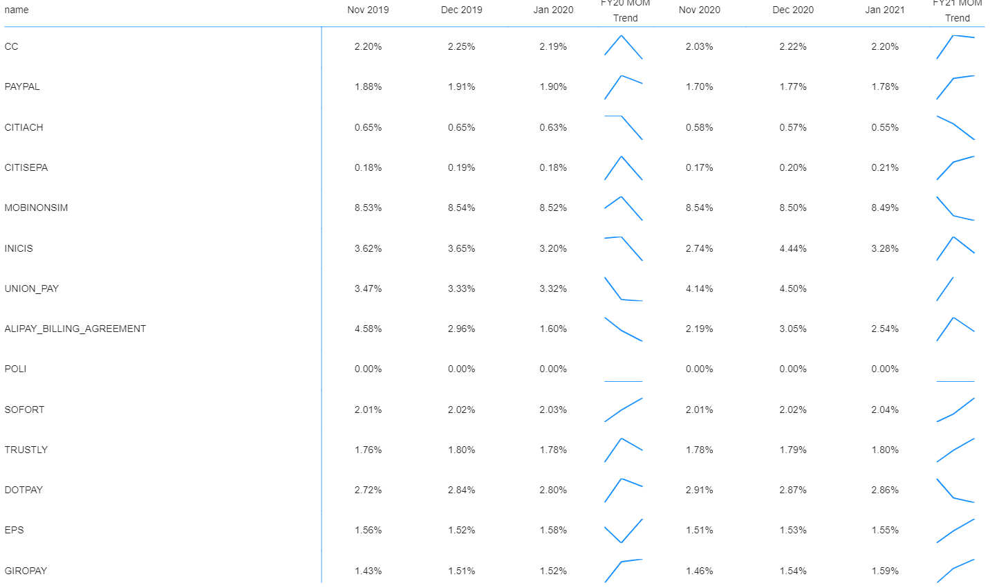

# Powerbi visual for interpolating

> Custom Visual using React and Victory.js

# Overview

This repository represents a way to use React, Victory and TypeScript to develop an interpolating power BI visual.

